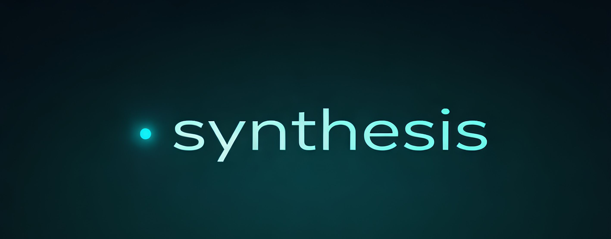

<p align="center">
  
</p>

<p align="center">
  <a href="https://smithery.ai/server/synthesis-mcp"></a>
  <a href="https://www.npmjs.com/package/synthesis-mcp"></a>
  <a href="LICENSE"></a>
</p>

# Synthesis MCP

A [Model Context Protocol](https://modelcontextprotocol.io) server that gives your AI coding assistant **persistent project memory**. Never lose context between sessions.

## The Problem

Every time you start a new coding session, your AI assistant forgets:
- What you were working on
- Decisions you made and why
- Bugs you fixed and their root causes
- Patterns you discovered

You end up re-explaining the same context over and over.

## The Solution

Synthesis provides 4 tools that maintain project context across sessions:

| Tool | Purpose |
|------|---------|
| `synthesis_start` | Load project state at session start |
| `synthesis_checkpoint` | Save progress after significant work |
| `synthesis_lesson` | Capture bugs fixed and patterns learned |
| `synthesis_search` | Search past lessons when stuck |

## Installation

### Hosted (Recommended)

Use the hosted Synthesis server at [synthis.tools](https://synthis.tools). Sign up to get an API key.

**Claude Code / Cline:**
```json
{
  "synthesis": {
    "type": "http",
    "url": "https://api.synthis.tools/mcp",
    "headers": {
      "Authorization": "Bearer YOUR_API_KEY"
    }
  }
}
```

### npx (Local)

Run locally via npx:

```json
{
  "synthesis": {
    "command": "npx",
    "args": ["synthesis-mcp@latest"],
    "env": {
      "SYNTHESIS_HOME": "~/my-synthesis-data"
    }
  }
}
```

### Smithery

```bash
npx @smithery/cli install synthesis-mcp
```

## Tools

### synthesis_start

**Call first** when starting work on a project. Loads project state and shows what to do next.

```typescript
synthesis_start({
  query: "my-project",           // Project name to search for
  register_if_new: true,         // Create if not found
  name: "My Project",            // Display name
  description: "Project desc"    // Optional description
})
```

### synthesis_checkpoint

**Call after significant work** - saves progress and updates CONTEXT.md.

```typescript
synthesis_checkpoint({
  project_id: "my-project",
  summary: "Added user authentication",
  files_changed: ["src/auth.ts", "src/routes.ts"],
  completed_steps: [1, 2],
  add_next_step: "Add password reset flow"
})
```

### synthesis_lesson

**Call when you solve something** - captures lessons for future sessions.

```typescript
synthesis_lesson({
  project_id: "my-project",
  type: "incident",              // or "pattern"
  title: "Fix CORS headers",
  what_happened: "API calls failing with CORS errors",
  solution: "Added proper Access-Control headers",
  keywords: ["cors", "api", "headers"]
})
```

### synthesis_search

**Call when stuck** - searches past lessons for solutions.

```typescript
synthesis_search({
  keywords: ["cors", "api"],
  error_message: "Access-Control-Allow-Origin"
})
```

## Data Storage

Synthesis stores project data in a local directory:

```
~/Claude Synthesis Projects/
├── index.yaml              # Project registry
├── _lessons/               # Cross-project lessons
└── tracking/
    └── my-project/
        ├── CONTEXT.md      # Project state
        └── work-logs/      # Session logs
```

Set `SYNTHESIS_HOME` environment variable to change the location.

## Development

```bash
# Install dependencies
npm install

# Build
npm run build

# Run with MCP Inspector
npm run dev

# Watch mode
npm run watch
```

## License

MIT
